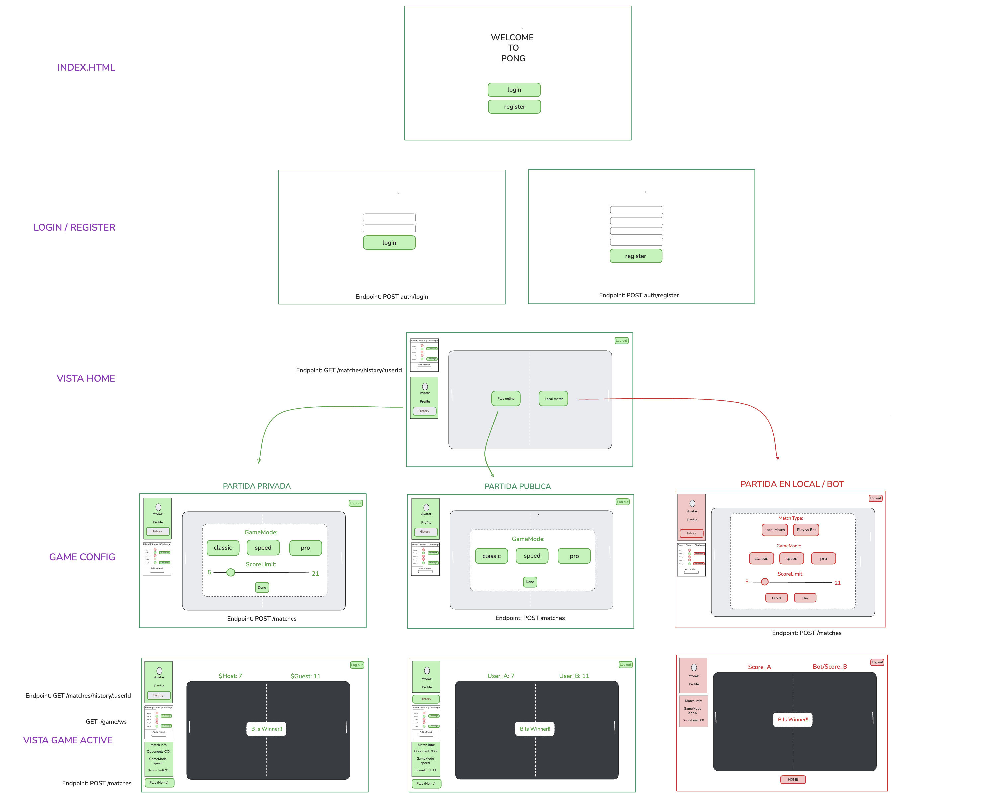
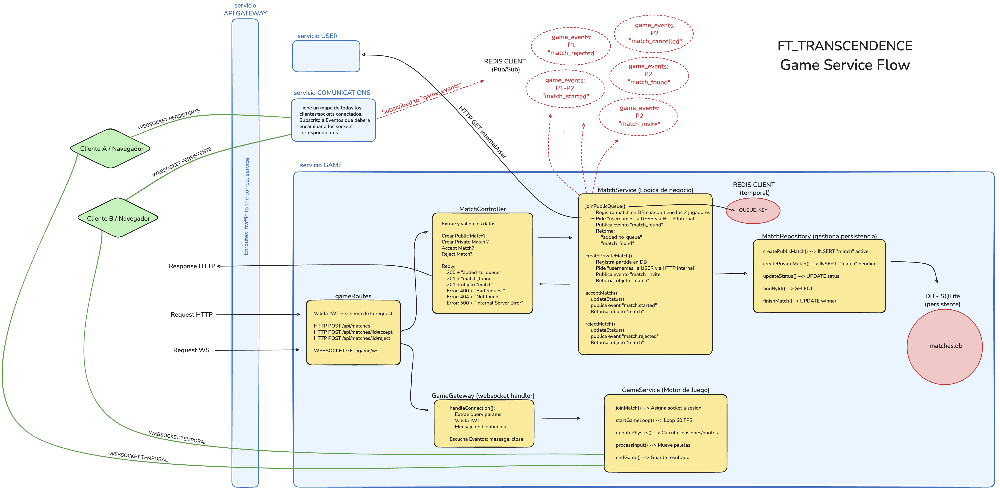
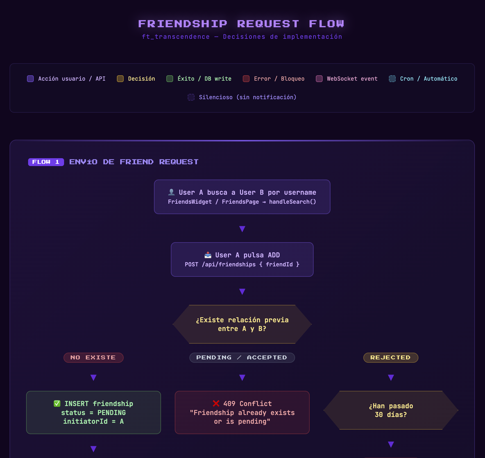

## Table of Contents

- [Description](#description)
- [Instructions](#instructions)
  - [Prerequisites](#prerequisites)
  - [Setup](#setup)
  - [Deploy with the Makefile](#deploy-with-the-makefile)
  - [Access](#access)
  - [Troubleshooting](#troubleshooting)
- [Technical Stack](#technical-stack)
- [Features List](#features-list)
- [Selected Modules & Points](#selected-modules--points)
- [Database Schema](#database-schema)
- [Team Information](#team-information)
- [Individual Contributions](#individual-contributions)
- [Project Management](#project-management)
- [Resources & AI](#resources--ai)
- [Design Process](#design-process)
- [Limitations](#limitations)
- [Annex — Post-evaluation features](#annex--post-evaluation-features)

---

## Description
*This project has been created as part of the 42 curriculum by jocuni-p, dKurbi, mvisca and meriusky.*

**Project name**: Transcendence

**One-liner**: A full-stack, containerized web app for **ft_transcendence** featuring secure authentication (incl. **2FA**), social features (friends + presence), and a real-time Pong-like game (including a bot opponent).

**Goal**: Build a modern, production-like web application that combines user management, real-time features, and gameplay—deployable with a single command via Docker Compose.

**Key features (high-level)**:
- **Authentication**: register/login/logout/refresh, **2FA (TOTP + backup code)**, password reset by email.
- **User profile**: profile management, avatar upload, account deletion.
- **Friends + presence**: friend requests/accept/reject/remove + online/offline presence via WebSockets.
- **Game**: real-time Pong-like matches over WebSockets, matchmaking, match history, and a bot opponent.

**Architecture (high-level)**:
- **Frontend**: React SPA (Vite) served via `nginx`
- **Backend**: Node.js services (containerized): `gateway`, `auth`, `user`, `game`, `comms`, `images`, `bot`
- **Data stores**: Redis + SQLite (game & user) with Docker volume mounts  
- **Entry point**: `nginx` (ports **8080/8443**), reverse-proxying the internal services

---

## Instructions

### Prerequisites

- **Docker** and **Docker Compose**
- **make**
- **A local `.env` file** (see `.env.example`)

### Setup

1. Create your `.env` file:

```bash
cp .env.example .env
```

2. Set required environment variables:

<details>
<summary>Full list of environment variables</summary>

- **Global**
  - `NODE_ENV`, `LOG_LEVEL`, `UID`, `GID`
- **Secrets**
  - `JWT_SECRET` (JWT signing)
  - `SERVICE_SECRET` (service-to-service auth, e.g. `X-Service-Secret`)
  - `COOKIE_SECRET`
- **Redis**
  - `REDIS_HOST`, `REDIS_PORT`, `REDIS_PASSWORD`, `REDIS_DB`
- **Gateway**
  - `GATEWAY_PORT`, `CORS_ORIGIN`, `WS_ALLOWED_ORIGINS`, plus WS and request limits
  - `DOCS_USER`, `DOCS_PASS` (Basic Auth for `/docs`)
- **SQLite persistence**
  - `USER_SERVICE_DB_PATH`, `USER_SERVICE_DB_FILENAME`
  - `GAME_SERVICE_DB_PATH`, `GAME_SERVICE_DB_FILENAME`
- **Frontend**
  - `VITE_API_URL`, `VITE_WS_COMMS_URL`, `VITE_WS_GAME_URL`, `VITE_DEFAULT_AVATAR`
- **Email (password reset)**
  - `SMTP_HOST`, `SMTP_PORT`, `SMTP_USER`, `SMTP_PASS`, `SMTP_FROM`
  - `RESET_URL_BASE`, `RESET_TTL_SECONDS`
- **Images**
  - Cloudinary credentials (`CLOUDINARY_*`)

</details>

3. Ensure certificates exist (HTTPS):
- Docker `nginx` will **auto-generate self-signed dev certs** (`tls.crt` / `tls.key`) if missing.
- The generated certs are stored in `packages/nginx/certs/` (mounted into the container).
- `HOST_UID` / `HOST_GID` are passed so the cert files are owned by your user on the host.

### Deploy with the Makefile

The app is deployed using the **Makefile**. No Node.js or pnpm is required on the host; everything runs inside Docker.


**Start the stack** (build images and start containers; no-op if already running):

```bash
make
# or: make up_build
```

**Makefile targets** (run `make help` for the full list):

| Target              | Description                                                                              |
|---------------------|------------------------------------------------------------------------------------------|
| `make` / `make all` | Start stack (build + up), then open browser. No-op if already running.                   |
| `make up_build`     | Build images and start containers. No-op if already running.                             |
| `make up`           | Start containers only (no build). No-op if already running.                              |
| `make build`        | Build Docker images only.                                                                |
| `make rebuild`      | Force rebuild and start (`docker compose up -d --build`).                                |
| `make re`           | Rebuild stack and open browser.                                                          |
| `make debug`        | Build and start in foreground (logs in terminal).                                        |
| `make down`         | Stop and remove containers and network. Keeps images and volumes.                        |
| `make stop`         | Stop containers (no remove). Use `make up` to start again.                               |
| `make clean`        | Down + remove locally built images. Keeps volumes (data).                                |
| `make fclean`       | Down + remove local images + remove volumes (full reset, data lost).                     |
| `make nuke`         | Remove DB files, dev TLS certs, then `docker system prune -a -f --volumes`. Destructive. |
| `make logs`         | Follow Docker Compose logs.                                                              |
| `make ps`           | List running containers.                                                                 |
| `make open-browser` | Open https://localhost:8443 in the default browser.                                      |
| `make download`     | Pull required base images from AWS Public ECR.                                           |

### Access

- **Web app**: `https://localhost:8443/`
- **API (via gateway)**: `https://localhost:8443/api/*`
- **WebSockets (via gateway)**:
  - Comms: `wss://localhost:8443/api/comms/ws`
  - Game: `wss://localhost:8443/api/game/ws`
- **Docs (Swagger)**: `https://localhost:8443/docs` (Basic Auth via `DOCS_USER` / `DOCS_PASS`)
- **Healthcheck**: `https://localhost:8443/health` (served by `nginx`)

### Troubleshooting

- **See logs**:

```bash
docker compose logs
docker compose logs -f {service name}
```

- **Redis CLI**:

```bash
docker exec -it ft_transcendence_redis redis-cli
```

---

## Technical Stack

### Frontend
- **React** (SPA) + **React Router**
- **Vite** (dev/build)
- **Tailwind CSS**
- **Zustand** (state management)

### Backend
- **Runtime**: Node.js
- **Framework**: Fastify (services + gateway)
- **Auth**: JWT + refresh tokens, optional 2FA (TOTP + backup codes)
- **Real-time**: WebSockets (game + comms) proxied via gateway + nginx

### Database / Storage
- **Redis**: inter-service events + pub/sub, matchmaking/queues/state, password-reset TTLs.
- **SQLite (better-sqlite3)**: per-service persistence for `user` and `game`.
- **Persistence**: SQLite DB directories are mounted as Docker volumes using `USER_SERVICE_DB_PATH` and `GAME_SERVICE_DB_PATH`.

### DevOps / Deployment
- **Docker Compose** to run the full stack with one command
- **nginx** as reverse proxy and HTTPS termination

<details>
<summary>Justification for major technical choices</summary>

- **React**: Flexible component-based architecture, ideal for building a dynamic SPA.
- **Microservices**: Better separation of concerns across domains (auth, users, game, comms...). Allows independent development and deployment per service.
- **Redis**: Designed for high-performance in-memory operations, ideal for real-time systems (pub/sub, matchmaking queues, TTLs).
- **SQLite**: Simple, embedded, and lightweight. Integrates seamlessly with a containerized architecture without the overhead of a dedicated DB server.
- **nginx**: High-performance, lightweight reverse proxy optimized for concurrent connections; handles HTTPS termination cleanly.
- **HTTPS**: Aligns the project with modern web security standards from the start, even in development.

</details>

---

## Features List

<details>
<summary>View features list</summary>

| Feature                             | Description                                     |
|-------------------------------------|-------------------------------------------------|
| Auth: register/login/logout/refresh | Secure auth flows (JWT + refresh tokens).       |
| 2FA (TOTP + backup codes)           | Setup and verification during login.            |
| Password reset                      | Email-based reset with TTL.                     |
| Profile                             | View/update user profile and settings.          |
| Avatars                             | Upload/delete avatars via image service.        |
| Friends                             | Friend requests + accept/reject/remove.         |
| Presence (WS)                       | Online/offline updates to friends via comms WS. |
| Game (WS)                           | Real-time Pong-like match over WebSockets.      |
| Matchmaking                         | Queue/room matching backed by Redis.            |
| Match history                       | Persisted match records and history UI.         |
| Bot opponent                        | Bot connects via WS and plays matches.          |

</details>

---

## Selected Modules & Points

<details>
<summary>View modules, points and justifications</summary>

| Category           | Module                                    | Type  | Points | Owner(s)                       |
|--------------------|-------------------------------------------|-------|--------|--------------------------------|
| WEB                | Framework (f/b)                           | Major | 2      | All                            |
| WEB                | Realtime WS                               | Major | 2      | jocuni-p, mvisca-g, dkurcbar  |
| WEB                | WebSocket Game                            | Major | 2      | jocuni-p                       |
| WEB                | Notification System                       | Minor | 1      | jocuni-p, mvisca-g             |
| WEB                | Custom-made design system                 | Minor | 1      | mehernan, mvisca-g             |
| ACCESSIBILITY      | Support for Additional Browsers           | Minor | 1      | mehernan, jocuni-p             |
| USER MANAGEMENT    | Standard User management                  | Major | 2      | All                            |
| USER MANAGEMENT    | 2FA                                       | Minor | 1      | mvisca-g                       |
| AI                 | AI Opponent                               | Major | 2      | jocuni-p                       |
| GAMING             | Complete Web Based Game                   | Major | 2      | jocuni-p                       |
| GAMING             | Remote players                            | Major | 2      | jocuni-p                       |
| GAMING             | Customisation options                     | Minor | 1      | jocuni-p                       |
| DEVOPS             | Backend as microservices                  | Major | 2      | All                            |
| MODULE OF CHOICE   | Centralized UI for OpenAPI Documentation  | Minor | 1      | dkurcbar                       |
| MODULE OF CHOICE   | Gateway & Secured Internal API Rest       | Minor | 1      | dkurcbar, jocuni-p, mvisca-g  |
| MODULE OF CHOICE   | Shared Contract Library                   | Minor | 1      | mvisca-g, jocuni-p             |

**Total points: 24**

<details>
<summary>Module justifications and implementation details (expand)</summary>

### IV.1 WEB — Framework (frontend + backend)

**Why:** Dedicated frameworks for frontend and backend enforce architectural conventions, reduce boilerplate, and make the system easier to reason about as it grows.

**How:** Frontend built as a React 19 SPA using Vite, with React Router for navigation and Zustand for global state. Backend services use Fastify v5: fast, schema-first HTTP with plugin-based extensibility.

**Who:** All

---

### IV.1 WEB — Real-time features (WebSockets)

**Why:** Social features (friend status, friend requests, match invitations) must update in real time without polling. WebSockets are the natural fit.

**How:** A dedicated `comms` service built on `@fastify/websocket` maintains a `Map<userId, Set<WebSocket>>` for multiple concurrent sessions per user. Inter-service events are broadcast via Redis pub/sub (`TRANSCENDENCE_CHANNEL`); the comms service translates Redis events into targeted WebSocket messages to connected clients.

**Who:** jocuni-p, mvisca-g, dkurcbar

---

### IV.1 WEB — WebSocket Game (real-time game)

**Why:** Frame-level synchronization between players requires persistent, low-latency connections. HTTP request/response is unsuitable.

**How:** The game service exposes a dedicated WebSocket endpoint. An authoritative server-side game loop computes physics, collisions, and scoring. Players send paddle movement events; the server broadcasts the canonical game state (`GAME_UPDATE`) on every tick.

**Who:** jocuni-p

---

### IV.1 WEB — Notification system

**Why:** Users need to be informed of relevant events (friend requests, match invitations, results) without refreshing or navigating away.

**How:** Notifications are delivered through the comms WebSocket connection. The frontend displays persistent action toasts (using `senderId` as toast ID to deduplicate) for events requiring interaction, and transient toasts for informational events. Dismissal is synchronized across handlers to avoid double-processing.

**Who:** jocuni-p, mvisca-g

---

### IV.1 WEB — Custom-made design system

**Why:** A consistent visual language across all pages ensures a coherent UX. Reusable components accelerate development.

**How:** A library of reusable UI components (`NeonButton`, `ArcadeButton`, `FormCard`, `FormInput`, `PasswordInput`, `AvatarDisplay`, `AvatarUploader`, `PageContainer`, `AlertError`, `AlertSuccess`, `LoadingScreen`, `LinkButton`) using Tailwind CSS, all exported from `src/shared/components/ui/index.ts`. Follows a consistent arcade/retro aesthetic with a defined color palette, typography, and spacing.

**Who:** mehernan, mvisca-g

---

### IV.2 ACCESSIBILITY — Support for additional browsers

**Why:** Limiting to a single browser reduces reach and introduces invisible bugs for users on different platforms.

**How:** Tested and validated on at least two additional browsers beyond Chrome (Firefox and Safari/Edge). Browser-specific behaviors around WebSocket handling, canvas rendering, and CSS were identified and resolved.

**Who:** mehernan, jocuni-p

---

### IV.3 USER MANAGEMENT — Standard user management

**Why:** The identity layer that all other modules build on.

**How:** Users register with email and password (bcrypt), log in via JWT-based auth, update profile (username, avatar), and upload avatars via Cloudinary. Friend management and online status are available in real time per user.

**Who:** mvisca-g, mehernan, dkurcbar

---

### IV.3 USER MANAGEMENT — Two-Factor Authentication (2FA)

**Why:** Passwords alone are insufficient for modern account security. 2FA adds a second layer and exposed us to real-world TOTP and recovery flows.

**How:** TOTP-based 2FA with a per-user secret. The login flow detects 2FA and requires a valid TOTP before issuing an access token (via a short-lived provisional token). Backup codes are generated at setup and can be used to recover access and disable 2FA.

**Who:** mvisca-g

---

### IV.4 ARTIFICIAL INTELLIGENCE — AI Opponent

**Why:** Ensures the game is always playable without a second human player. Improves solo UX and reduces dependency on matchmaking.

**How:** A standalone bot service connects to a match via WebSocket using a self-signed JWT, playing as a regular participant. The bot reads live game state (`GAME_UPDATE`) and computes paddle movement using configurable difficulty: `botSpeed`, `errorMargin`, and `reactionRate`. Three difficulty levels: `classic`, `speed`, and `pro`.

**Who:** jocuni-p

---

### IV.6 GAMING — Complete web-based game

**Why:** Real-time multiplayer game is the core of the project. Pong was chosen for its clear rules, letting us focus on real-time synchronization challenges.

**How:** Rendered on an HTML5 Canvas. The backend runs the authoritative game loop (physics, collisions, scoring) and broadcasts state via WebSocket. Supports 1v1, local play, and bot matches. Results persisted in the database.

**Who:** jocuni-p

---

### IV.6 GAMING — Remote players

**Why:** Two players on separate machines playing in real time is the defining feature of an online multiplayer platform.

**How:** Two players connect to the same match room via WebSocket. Server maintains authoritative state and broadcasts on every tick. Disconnections are handled gracefully: opponent is notified via `GAME_OPPONENT_DISCONNECTED` and given a configurable wait window before forfeit is recorded.

**Who:** jocuni-p

---

### IV.6 GAMING — Customisation options

**Why:** Customization improves engagement and adds replayability.

**How:** Three game modes — `classic`, `speed`, and `pro` — each with different physics parameters and AI difficulty settings. Users select mode before a match. Default options always available.

**Who:** jocuni-p

---

### IV.7 DEVOPS — Backend as microservices

**Why:** Separates concerns into independently deployable units, improving fault isolation, scalability, and allowing parallel team development.

**How:** Six independent services — `auth`, `user`, `game`, `comms`, `images`, `bot` — each in its own Docker container with its own schema, config, and responsibilities. A `gateway` service routes all external traffic. Services communicate via HTTP (inter-service) and Redis pub/sub (async events). Orchestrated with Docker Compose.

**Who:** All

---

### MODULE OF CHOICE — Centralized UI for OpenAPI Documentation

**Why:** With six backend services each exposing their own API, documentation becomes fragmented. A centralized UI is essential for development, debugging, and evaluation.

**How:** Each service exposes its OpenAPI JSON via `@fastify/swagger`. The gateway aggregates these at `/docs`, serving a unified Swagger UI with a custom dark theme. The gateway rewrites server URLs in each spec so "Try it out" calls go through the gateway, reflecting the real request flow.

**Who:** dkurcbar

---

### MODULE OF CHOICE — Gateway & Secured Internal API

**Why:** In a microservices architecture, directly exposing each service creates security, routing, and observability problems.

**How:** The gateway validates JWT tokens on all protected routes before proxying upstream. Internal service-to-service communication uses an internal route prefix (not externally exposed), protected by a shared secret. Includes rate limiting via Redis and request ID attachment for distributed tracing.

**Who:** dkurcbar, jocuni-p, mvisca-g

---

### MODULE OF CHOICE — Shared Contract Library (`@transcendence/shared`)

**Why:** In a distributed system, the biggest consistency risk is divergence — different names for the same events, different validation rules, different error shapes. Solved at the architectural level with a single source of truth.

**How:** A compiled TypeScript package (with generated `.d.ts` declarations) consumed by all services and the frontend. Provides: typed event constants for Redis pub/sub and WebSocket; TypeBox schemas for all domain entities; centralized environment config with typed accessors; a unified error class hierarchy (`AppError` and subtypes); shared utilities (Redis client factory, `RedisCache`, UUID generators, pino logger, normalizers); and a prebuild script that auto-generates JSON schemas from TypeBox definitions.

**Who:** mvisca-g, jocuni-p

</details>

</details>

---

## Database Schema

<details>
<summary>View database schema</summary>

### User service (SQLite)

DB file path configured via `USER_SERVICE_DB_*`.

```text
						+----------------------+
						|        users         |
						+----------------------+
						| id (PK)              |
						| username             |
						| email                |
						| password_hash        |
						| avatar               |
						| is_online            |
						| is_deleted           |
						| has_2fa_enabled      |
						| totp_secret          |
						| backup_code_hash     |
						| last_logout_at       |
						| created_at           |
						| updated_at           |
						+----------+-----------+
								   |
	   ----------------------------+----------------------------
	   |                           |                           |
	  hash                user_id friends_id          player1_id player2_id
	   |                           |                           |
+----------------------+   +----------------------+   +----------------------+
|    refresh_tokens    |   |     friendships      |   |        matches       |
+----------------------+   +----------------------+   +----------------------+
| id (PK)              |   | user_id (FK)         |   | id (PK)              |
| user_id (FK)         |   | friend_id (FK)       |   | status               |
| token_hash           |   | initiator_id         |   | player1_id (FK)      |
| expires_at           |   | status               |   | player1_username     |
| is_2fa_verified      |   | created_at           |   | player1_avatar       |
| created_at           |   | updated_at           |   | player1_score        |
+----------------------+   +----------------------+   | player2_id (FK)      |
													  | player2_username     |
													  | player2_avatar       |
													  | player2_score        |
													  | winner_id            |
													  | game_mode            |
													  | target_score         |
													  | created_at           |
													  | finished_at          |
													  +----------------------+
```

### Game service (SQLite)

DB file path configured via `GAME_SERVICE_DB_*`.

```text
+--------------------+
|      matches       |
+--------------------+
| id (PK)            |
| status             |
| player1_id (FK)    |
| player1_username   |
| player1_avatar     |
| player1_score      |
| player2_id (FK)    |
| player2_username   |
| player2_avatar     |
| player2_score      |
| winner_id          |
| game_mode          |
| target_score       |
| created_at         |
| finished_at        |
+--------------------+
```

</details>

---

## Team Information

<details>
<summary>View team information</summary>

| 42 login   | Name      | Role            | Responsibilities                                            |
|------------|-----------|-----------------|-------------------------------------------------------------|
| mehernan   | Meritxell | Product Owner   | Product vision, backlog, validation, stakeholder comms      |
| jocuni-p   | Joan      | Product Manager | Planning, tracking, removing blockers, facilitation         |
| mvisca-g   | Martin    | Tech Lead       | Architecture, key decisions, code quality, reviews          |
| dkurcbar   | Diego     | Developer       | Features implemented, ownership areas                       |

</details>

---

## Individual Contributions

<details>
<summary>View individual contributions</summary>

### jocuni-p / Joan — Product Manager

**Modules delivered:** Framework (f/b), Realtime WS, WebSocket Game, Notification System, Support for Additional Browsers, Standard User Management, AI Opponent, Complete Web-Based Game, Remote Players, Customisation Options, Backend as Microservices, Gateway & Secured Internal API, Shared Contract Library.

**Notable challenge:** Adapting all backend services to structured logging with Pino. Each service needed a consistent logger instance with child loggers carrying contextual metadata (service name, request ID, match ID) without coupling services to a specific setup. Solution: centralizing the logger factory in `@transcendence/shared` so every service consumes the same configuration while retaining per-service context.

---

### mehernan / Meritxell — Product Owner

**Modules delivered:** Framework (f/b), Custom-made Design System, Support for Additional Browsers, Standard User Management, Backend as Microservices.

**Notable challenge:** Integrating the frontend with the backend in a multi-service architecture — particularly JWT authentication, token propagation in request headers, and handling asynchronous API responses correctly. Working through those flows deepened understanding of how the auth layer intersects with every feature.

---

### dkurcbar / Diego — Developer

**Modules delivered:** Framework (f/b), Realtime WS, Standard User Management, Backend as Microservices, Centralized UI for OpenAPI Documentation, Gateway & Secured Internal API.

**Notable challenge:** Two environment-specific issues on 42's machines. First, ports 443 and 80 are unavailable — nginx and Docker Compose had to be adjusted to use allowed ports. Second, UUID generation for user IDs produced values exceeding 42's SQLite maximum integer — resolved by switching to a string-based UUID strategy consistent across all services.

---

### mvisca-g / Martin — Tech Lead

**Modules delivered:** Framework (f/b), Realtime WS, Notification System, Custom-made Design System, Standard User Management, 2FA, AI Opponent, Backend as Microservices, Gateway & Secured Internal API, Shared Contract Library.

**Notable challenge:** A query parameter (`wsRawUrl`) captured correctly in the gateway's `onRequest` hook was lost by the time the WebSocket handler ran. Root cause: `@fastify/websocket` v11 instantiates a separate request object for the WS handler, so hook-set properties don't persist. Fix: registering `app.decorateRequest('wsRawUrl', '')` to declare the property on the Fastify request prototype first, then assigning in `onRequest`.

</details>

---

## Project Management

<details>
<summary>View project management details</summary>

**How we organized the work:**

At the start, the team worked in person on campus to define the initial architecture, share ideas, and distribute responsibilities based on previous experience and personal interest:
- One member focused on frontend development.
- One member focused on game implementation.
- Three members worked on backend services and Docker infrastructure.

During development, a team member left and subject requirements were updated. The team adapted scope and organization accordingly, shifting to a more flexible workflow:
- Weekly meetings to review progress and discuss blockers.
- Continuous async updates between members.
- Iterative improvements rather than strict sprint planning.

**Tools:**
- GitHub — repositories, version control, and collaboration.
- GitHub Codespaces — early-stage frontend development and testing.
- Notion — architecture planning, diagrams, and shared notes.
- Docker / Docker Compose — development and deployment environment.

**Communication:**
- Campus — initial in-person discussions.
- WhatsApp — main channel for daily coordination.
- Google Meet — weekly meetings to share progress, discuss technical challenges, and align next steps.

</details>

---

## Resources & AI

<details>
<summary>View resources and AI usage</summary>

Throughout the project, AI tools were used as a support for learning and problem-solving, not as a replacement for our own understanding.

AI was mainly used as an interactive learning resource — asking direct and specific questions when facing new concepts (frontend frameworks, state management, WebSockets, Docker-based architectures). This was especially useful for technologies new to some or all team members.

Alongside AI, we relied on peer support and external learning resources: help from other students when discussing concepts or debugging complex issues, YouTube tutorials, and official documentation.

</details>

---

## Design Process

<details>
<summary>View design process diagrams</summary>

### Wireframe — Browser layout
*Initial wireframe sketched at the start of the project to outline the distribution of views in the browser.*



---

### Game Service — Architecture overview
*High-level diagram of the Game Service and its role within the broader system.*



</details>

---

### Friendship Request — Complete flow
*Click the image to view the full interactive flow on GitHub Pages.*

<a href="https://jocuni-p.github.io/ft_transcendence/friendship_flow" target="_blank">
  
</a>
>>>>>>ATENCIÓN>>>>: Cuando pongamos el repo como 'Public', subir docs/assets/friendship_flow.html a GitHub Pages y linkarle esta imagen.

---

## Limitations

<details>
<summary>View known limitations</summary>

- **Connection management debt:** When a player disconnects during an online game, the waiting player waits 15 seconds. If the disconnected player reconnects within that window, the game loses the paused state and resumes against the already-disconnected opponent.
- **Missing UX improvement:** Connection and disconnection notifications could be displayed as a widget below the friends list, but this was left out of scope.

</details>

---

## Annex — Post-evaluation features

<details>
<summary>View post-evaluation features</summary>

*Features implemented after the project evaluation, as continued development.*

| Feature | Description |
|---|---|
| Internationalisation (i18next) | UI available in 4 languages via i18next. |
| Match countdown | Visual countdown displayed at the start of each match. |
| Match sound effects | Audio feedback throughout the game: countdown beeps, serve, bounces, score/goal, and victory/defeat jingles. |
| Match request list widget | Incoming match requests displayed as an inline widget. |
| Visual timeout timelines | Animated progress timelines added to end-of-match screens, wait timeout views, and the match invitation acceptance timeout. |

</details>
