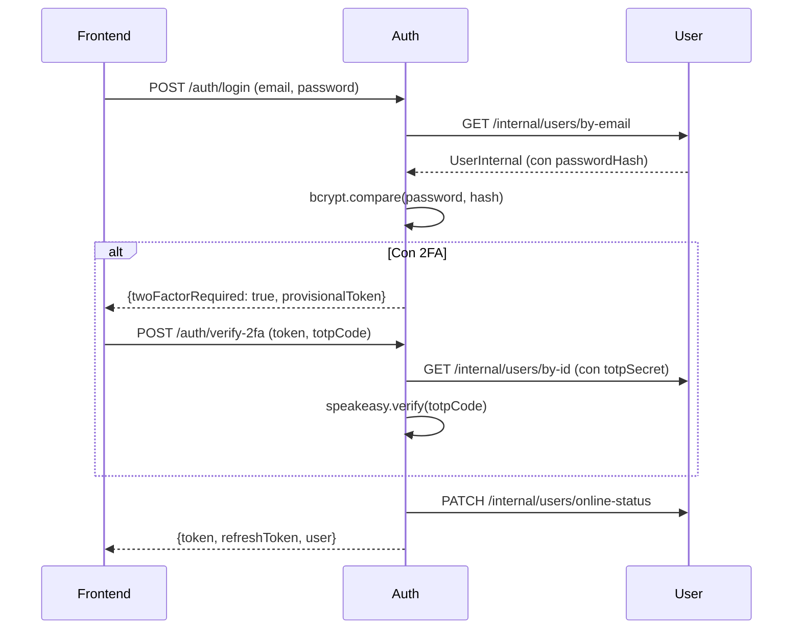

```mermaid
sequenceDiagram
	Frontend->>Auth: POST /auth/login (email, password)
	Auth->>User: GET /internal/users/by-email
	User-->>Auth: UserInternal (con passwordHash)
	Auth->>Auth: bcrypt.compare(password, hash)
	alt Con 2FA
		Auth-->>Frontend: {twoFactorRequired: true, provisionalToken}
		Frontend->>Auth: POST /auth/verify-2fa (token, totpCode)
		Auth->>User: GET /internal/users/by-id (con totpSecret)
		Auth->>Auth: speakeasy.verify(totpCode)
	end
	Auth->>User: PATCH /internal/users/online-status
	Auth-->>Frontend: {token, refreshToken, user}
```